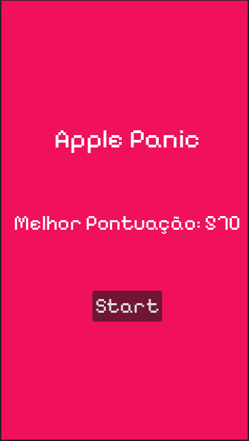
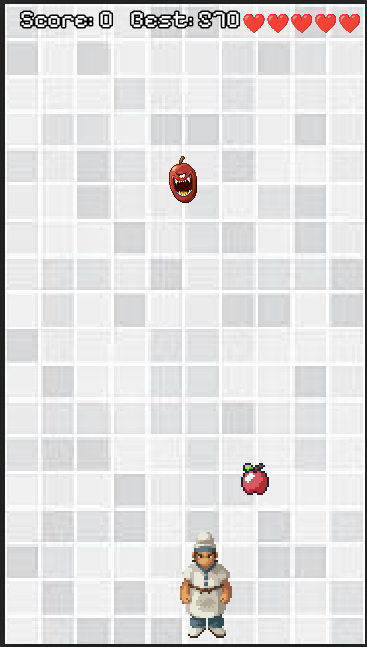

# Apple Panic - Projeto Pós-Graduação

Este projeto consiste em um jogo arcade desenvolvido como parte do curso de pós-graduação em desenvolvimento de dispositivos móveis. O objetivo é controlar um Chef para coletar itens de comida saudáveis enquanto evita maçãs amaldiçoadas que caem do topo da tela.

## Descrição Técnica

O jogo foi desenvolvido utilizando o motor **Godot Engine 4** com a linguagem **C# (.NET)**. O projeto foca na implementação de padrões de design comuns em jogos e lógica de progressão dinâmica.

### Principais Funcionalidades

- **Lógica de Dificuldade Progressiva**: A frequência de surgimento (spawn rate) e a velocidade de queda dos itens aumentam conforme a pontuação do jogador cresce.
- **Sistema de Persistência**: O recorde (High Score) é salvo localmente em um arquivo de configuração (`.cfg`), garantindo que o progresso seja mantido entre sessões.
- **Gerenciamento de Estado**: Implementação de menus de início, jogo e Game Over, utilizando controle de pausa e sinais para comunicação entre nós.
- **Arquitetura Baseada em Sinais**: Uso de Singletons (GameManager) e EventHandlers para desacoplamento da interface de usuário e lógica de jogo.

## Como Jogar

1.  **Movimentação**: Utilize as setas direcionais (Esquerda/Direita) para mover o Chef.
2.  **Objetivo**: Colete os itens de comida para ganhar pontos.
3.  **Desafio**: Evite as maçãs vermelhas (amaldiçoadas). Cada colisão com elas remove uma de suas 5 vidas.
4.  **Game Over**: O jogo termina quando todas as vidas são perdidas.

## Screenshots

## Tecnologias Utilizadas

- Godot Engine 4.x
- .NET 8.0
- C#
- Persistência de dados via ConfigFile
